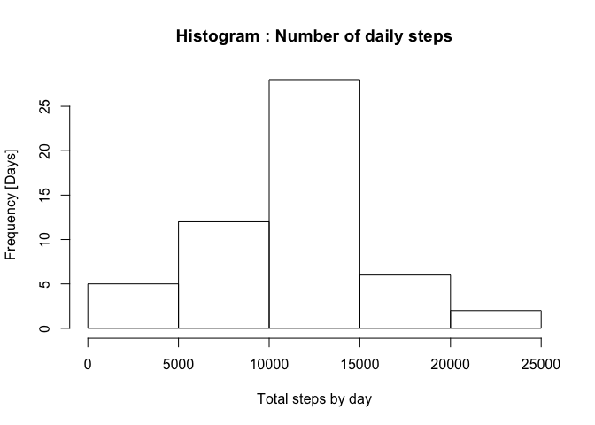

# Reproducible Research: Peer Assessment 1
Daniel Rodrigues Ambrosio  

This assignment makes use of data from a personal activity monitoring device. This device collects data at 5 minute intervals through out the day. The data consists of two months of data from an anonymous individual collected during the months of October and November, 2012 and include the number of steps taken in 5 minute intervals each day.


## Loading and preprocessing the data
The chunck of R Code below should download a zip file from its original location into a data folder.
After downloading it, unzip it into the same data folder. 

Original location of the zip file: https://d396qusza40orc.cloudfront.net/repdata%2Fdata%2Factivity.zip


```r
# variables to handle path, dir and file names
dir.data <- paste(getwd(),"data",sep="/")
file.csv <- paste(dir.data,"activity.csv",sep="/")
zipFile <- paste(dir.data,"projectdata.zip",sep="/")
# if data folder does not exist, create it
if(!file.exists(dir.data)) {dir.create(dir.data)}
# donwload zip file only if it does not exist locally
if(!file.exists(zipFile)) {
    zipFileURL <- "https://d396qusza40orc.cloudfront.net/repdata%2Fdata%2Factivity.zip"
    download.file(zipFileURL, destfile=zipFile, method="curl")
}
# unzip file only if the raws csv file cannot be found
if(!file.exists(file.csv)) {
    unzip(zipFile, exdir=dir.data)
} 
# read the CSV file
activity <- read.csv(file.csv)
str(activity)
```

```
## 'data.frame':	17568 obs. of  3 variables:
##  $ steps   : int  NA NA NA NA NA NA NA NA NA NA ...
##  $ date    : Factor w/ 61 levels "2012-10-01","2012-10-02",..: 1 1 1 1 1 1 1 1 1 1 ...
##  $ interval: int  0 5 10 15 20 25 30 35 40 45 ...
```


## What is mean total number of steps taken per day?

### 1. Make a histogram of the total number of steps taken each day

The following code will aggregate all the steps per day and store it in a new variable.
Then this new variable is used to plot a bar graph having the date in the x axis and the amount of steps in the y axis.


```r
steps.aggregate <- aggregate(steps~date,activity,sum)
hist(steps.aggregate$steps, xlab="Total steps by day", ylab="Frequency [Days]",main="Histogram : Number of daily steps")
```

 

### 2. Calculate and report the **mean** and **median** total number of steps taken per day


```r
mean(steps.aggregate$steps, na.rm=TRUE)
```

```
## [1] 10766.19
```

```r
median(steps.aggregate$steps, na.rm=TRUE)
```

```
## [1] 10765
```


## What is the average daily activity pattern?


## Inputing missing values


## Are there differences in activity patterns between weekdays and weekends?


